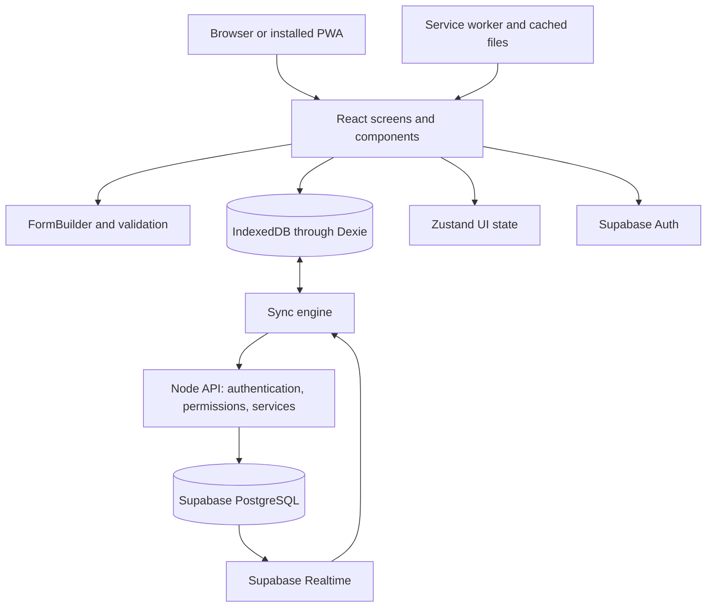

# Ebenezer: application and architecture

Status: hackathon design with implemented local foundations and remaining product refinements. See [Development progress](./development-progress.md) for the audited 14-stage checklist.
Last updated: October 5, 2026.

Read [User flows](./user-flows.md) for the experience this architecture supports.

Implementation progress: stages 1–8 have local foundations; first-use onboarding and shared feeling/tone cards are now implemented. Language review, richer journey features and physical mobile verification remain before full milestone sign-off. Shared UI, English/Spanish localization, a typed FormBuilder, the five-moment reflection journey, profile form, and Dexie/IndexedDB persistence are available. Drafts autosave and restore their step; completed stones appear in My Story. The database includes versioned migrations, atomic saves, and account-scoped outbox infrastructure, with no live cloud synchronization. Tests cover the actual form's language switching, draft recovery, validation, storage failures, rollback, and schema upgrades. Stage 7 adds searchable history, tone/date filters, full reflection details, editing through the shared FormBuilder, confirmed deletion, and JSON backup export/import. Imports validate format/version, dates, field lengths, and IDs before a single atomic transaction; existing IDs are skipped and never overwritten. Backup files are limited to 10 MB and 10,000 stones. Editing preserves unfinished drafts. Stage 8 adds a production-only generated service worker, a standalone manifest, offline status, installation guidance, and explicit update activation. All built chunks, CSS, fonts, and bundled translation resources are precached. Reflection drafts flush before reload; dirty editors block updates. APIs and external data bypass caching, and updates never clear IndexedDB. Prior asset caches are retained for older open tabs; bounded cleanup with client-version tracking remains a release refinement. Hindi/Chinese, extended archive/song views, authentication, and synchronization remain future stages.

## 1. What Ebenezer does

Ebenezer is a Christian reflection and journaling application. It helps people connect everyday experiences with Scripture, record memories of God's help as **stones**, and revisit those memories for encouragement. The primary audience includes international students living and studying away from home, including those navigating homesickness, belonging, academic pressure and returning home. The personal journal can serve a wider audience.

The central journey is **Feel → Read → Reflect → Together → Stone**. Every stone is associated with Scripture. Users may keep their journal on one device, opt into private cloud synchronization, or explicitly publish selected content to a community group.

The main areas are:

| Area                 | Purpose                                                                           |
| -------------------- | --------------------------------------------------------------------------------- |
| Today                | Suggested Scripture, daily intentions, morning routine, and starting a reflection |
| Reflection           | Guided five-moment journey with saved drafts                                      |
| My Story             | Personal stones, tower/book views, songs, and period reviews                      |
| Community / Together | Groups, published stones, comments, and prayer reactions                          |
| Settings             | Language, theme, privacy, export/import, and synchronization                      |

The product is a responsive Progressive Web App (PWA): people can use its website without installation, or add it to their home screen where supported. Desktop and mobile share one frontend. Offline functionality must be implemented explicitly; choosing React or making an app installable does not provide it automatically.

## 2. Current prototype versus rebuild

The existing project contains `index.html`, `manifest.json`, `sw.js`, `README.txt`, and three icons. HTML, CSS, Scripture content, and JavaScript are largely in one file. Personal records use `localStorage`; the service worker caches application files. Live community integration depends on `claude.use('db')` and `claude.use('user')`, which are unavailable in an ordinary hosted website. Groups, the prayer board, and local chat include demonstration content.

The rebuild will replace those environment-dependent integrations with independent authentication and storage. It will add reliable drafts, synchronization, real group permissions, and reusable components. Preserve the original files under `legacy/original-pwa/` during implementation. This documentation does not imply that migration or any new features have already been completed.

## 3. Agreed technology stack

| Technology                                      | Responsibility                          | Reason                                             |
| ----------------------------------------------- | --------------------------------------- | -------------------------------------------------- |
| React + TypeScript                              | Frontend and typed application models   | Reusable, maintainable interactive screens         |
| Vite                                            | Development and static production build | Simple fit for an offline application              |
| React Router                                    | Routes, navigation, and browser Back    | Proper browser navigation                          |
| Tailwind CSS                                    | Styling using semantic tokens           | Consistent responsive design                       |
| Radix primitives and native dialog              | Accessible interactive UI foundations   | Shared Select and a common native Dialog primitive |
| class-variance-authority (CVA)                  | Typed component variants                | Consistent Button/Badge conventions                |
| clsx + tailwind-merge                           | Shared `cn()` utility                   | Predictable class merging                          |
| React Hook Form + Zod                           | Forms and validation                    | Typed, reusable form behavior                      |
| i18next + react-i18next                         | Translation keys and language switching | Client-side localization available offline         |
| Zustand (optional later)                        | Shared state across unrelated screens   | Current dialogs and selected views use React state |
| Dexie + IndexedDB                               | Durable local records                   | Offline journal, drafts, and pending changes       |
| Service worker + Workbox / Vite PWA integration | Cached app files and update lifecycle   | Offline opening and installation support           |
| Node.js + TypeScript + Fastify                  | One modular backend API                 | Validation, permissions, and synchronization       |
| Supabase Auth                                   | Accounts and authentication             | Optional login and account recovery                |
| Supabase PostgreSQL                             | Accepted cloud records                  | Private sync and community storage                 |
| Supabase Realtime                               | Online change notifications             | Prompt catch-up fetches for active community views |
| pnpm workspace                                  | Repository tooling                      | Frontend, API, and shared contracts                |

Choose compatible package versions together during scaffolding and commit the lockfile. Exact package versions are not prescribed by this design. Next.js is not selected: the journal needs client-side offline operation and has little need for server rendering. Redis is not required for the initial application.

## 4. System architecture



Normal journal reads come from IndexedDB. A user's save does not wait for the backend to wake up or for an internet connection. Node owns application mutations and synchronization; direct browser-to-Supabase authentication and authorized realtime subscriptions are exceptions to that API boundary. Avoid duplicating write rules across multiple client paths.

## 5. Repository structure

```text
ebenezer/
├── legacy/original-pwa/
├── apps/
│   ├── web/
│   │   ├── public/icons/
│   │   └── src/
│   │       ├── app/                 # Router, providers, app shell
│   │       ├── components/
│   │       │   └── ui/              # Controls, content components, AppShell,
│   │       │                       # and future FormBuilder/FormWizard
│   │       ├── pages/              # Screens composing common UI
│   │       ├── features/            # auth, onboarding, scripture, stones,
│   │       │                       # story, community, settings
│   │       ├── db/                  # Dexie schema, migrations, repositories
│   │       ├── sync/                # Outbox, retries, cursor, conflicts
│   │       ├── stores/              # Small Zustand stores
│   │       ├── i18n/
│   │       ├── locales/             # en, hi, es, zh
│   │       ├── styles/              # theme.css and globals.css
│   │       └── lib/                 # API client, utilities, bible/ (search worker + types)
│   └── api/
│       ├── src/
│       │   ├── app.ts               # Fastify setup, error handler, registerModules()
│       │   ├── config/              # Environment validation
│       │   ├── database/            # Generated Supabase types
│       │   ├── shared/              # errors/, http/ (auth, no-store), supabase/
│       │   └── modules/             # One folder per feature, served under /v1
│       │       ├── index.ts         # Module registry
│       │       └── profiles/        # index.ts (public), routes, controller, service,
│       │                            # repository, types, fake, *.test.ts
│       └── test/                    # helpers/ and integration/
├── packages/contracts/             # Shared Zod schemas and API types
├── supabase/
│   ├── migrations/
│   └── seed.sql
└── docs/
```

Keep shared UI inside the frontend initially; extract a UI package only when another application needs it. Use feature modules and a single API service rather than microservices.

## 6. Design system and common components

Use `styles/theme.css` for color tokens, light/dark overrides, typography, spacing, radii, and shadows. Use `styles/globals.css` for Tailwind imports, base styling, focus indicators, and reduced-motion support. Map tokens to semantic utilities such as `bg-primary`, `text-foreground`, and `border-border`.

| Token                | Light value | Purpose                             |
| -------------------- | ----------- | ----------------------------------- |
| Background           | `#F7F6F2`   | Warm page background                |
| Card                 | `#FFFFFF`   | Forms and journal cards             |
| Foreground           | `#182B36`   | Main text                           |
| Primary              | `#173B4D`   | Main buttons and navigation         |
| Primary foreground   | `#FFFFFF`   | Text on primary                     |
| Secondary            | `#E3EFEB`   | Selected chips and soft panels      |
| Secondary foreground | `#245B50`   | Text on secondary                   |
| Teal                 | `#287568`   | Supporting actions and mixed stones |
| Gold                 | `#D9A441`   | Highlights and bright stones        |
| Gold foreground      | `#30230D`   | Text on gold                        |
| Muted foreground     | `#596B75`   | Supporting text                     |
| Border               | `#DCE3DF`   | Inputs and separators               |
| Destructive          | `#B83D45`   | Errors and deletion                 |

Dark theme starting values: background `#101B23`, card `#172832`, foreground `#EDF3F0`, primary `#8DCDBE` with dark foreground, and border `#31444E`. Verify contrast for actual pairings rather than assuming every token combination is accessible.

Typography: self-hosted Plus Jakarta Sans Variable for interface text, navigation, and display headings, with a system serif stack reserved for Scripture quotations. The geometric sans-serif is our selected alternative to the requested Codec Pro style. Font assets are bundled by Vite; offline availability will follow the application asset-caching stage. Include the font license at `apps/web/public/licenses/plus-jakarta-sans.txt`.

Follow the supplied Badge pattern: `import * as React from "react"`, `cva()`, `VariantProps`, `cn()`, normal React props, and `className` overrides. Shared primitives include Button, Badge, Card, Input, Textarea, Select, Checkbox, Switch, Dialog, Sheet, Tabs, Progress, Alert, Toast, Skeleton, and EmptyState.

All reusable UI lives in `components/ui/`, including AppShell, page headings, content layouts/cards, empty states, and LanguageSelect. Pages compose these components and supply translated data and actions; they do not own visual classes or raw HTML. ESLint enforces this boundary for App, pages, and future feature screens. Semantic HTML is implemented inside the common components. The shared Select uses Radix for keyboard interaction, focus handling, and a portaled, theme-aware option list. Both language selectors use this component rather than the browser-native dropdown. The configuration-driven FormBuilder also composes these primitives.

Dialogs follow the shared layout pattern reviewed in Frontier Connect: `Dialog` → `DialogModalLayout` → specific dialog content. `components/ui/dialog.tsx` is the sole owner of the native modal element, focus restoration, Escape/backdrop handling, size variants and backdrop styling. `DialogModalLayout` composes the common title, description, close action, scrolling body and fixed footer. Both StoneDetail and ConfirmDialog use that layout. Busy confirmations block closing. ESLint prohibits separate native modal shells or `showModal()` calls elsewhere in the UI. The implementation is self-contained and does not import the Frontier Connect workspace.

StoryPage owns journal queries, filters and the selected stone ID. StoneTower, StoryViewSwitcher, StoneDetail and Disclosure own presentation. Stone appearance values are shared in `components/ui/stone-appearance.ts`; colour tokens live in `styles/theme.css`. Passage metadata is shared in `lib/scripture.ts` so the reflection form and memory view use the same source. UI components do not write to IndexedDB.

The reflection screen composes common JourneyLayout, JourneyPath, JourneyMoment, FeelingStones, JourneyScripture and StonePreview components. A compact path sits across the top; the current conversational moment uses an open, centred layout without welcome-style panels. Feeling stones wrap into balanced rows, lift and change colour when selected, and show encouragement underneath. Motion respects reduced-motion preferences. Mobile continuation actions remain above the bottom navigation while scrolling. Progress is presentational, so users cannot bypass validation by clicking a future stone. Native checkboxes support multiple feelings and keyboard interaction. All five reflection writing spaces stay open in the shared FormBuilder, with conversational prompts instead of accordion headings. Success status is a quiet live region; save failures remain visible alerts. No UI component stores data or infers a final stone tone.

Domain components include StoneCard, ScriptureCard, EmotionPicker, TonePicker, PathStepper, OfflineBanner, and SyncStatus. Show tone names as well as colors. Provide mobile bottom navigation, desktop sidebar navigation, safe-area spacing, readable content widths, keyboard interaction, focus management, and touch-friendly targets.

HeartSpace is the common, always-open check-in composer rendered by FormBuilder. Its translated invitation welcomes gratitude, joy, burdens and uncertainty. It uses the shared Textarea and Button, grows with entered text up to a scrolling limit, and appends optional starter phrases without replacing personal writing. React Hook Form still owns the value, validation and draft saving; no separate local copy of the text is maintained. JournalPrompt renders the five always-open reflection invitations in shared Card components: a generous primary writing space, followed by four smaller spaces arranged in two columns on wider screens and one column on phones. Conversational labels, subtle icons and warm theme colours replace form section headings. FormBuilder owns the responsive arrangement; feature configuration supplies only the prompt kind and translation keys. Both JournalPrompt and HeartSpace reuse WritingArea for text that grows as the person writes. The optional partner entry retains its disclosure.

`frontier-connect` is a reference for UI conventions, FormBuilder/wizard structure, and semantic Tailwind tokens. Adapt a smaller typed version; do not copy its entire feature set or its Next.js-specific localization setup.

## 7. Forms and state ownership

All forms use a shared configuration-driven FormBuilder, including login, onboarding, reflections, stone editing, weekly reflections, settings, comments, and message composition when implemented. It is a renderer, not a drag-and-drop form-design product.

Each form supplies a typed Zod schema, field configuration, translation keys, default values, and save/submit callback. Current field types support text, email, password, textarea, heart-space, journal-prompt, select, checkbox, time, radio choices, passage cards and multiple feeling stones. Optional prompts can use a configured disclosure. ReflectionSession owns step validation, navigation and draft persistence; FormBuilder owns rendering and React Hook Form manages values. useReflectionForm normalizes older single-feeling records for both the journey and stone editing. Optional `feelings` and `checkIn` fields preserve mixed emotions and the user's own words; the legacy `feel` remains the first selection for compatibility. At least one feeling or a non-empty check-in is required. Older records and version-1 backups remain readable. New check-ins also appear in stone details and journal search. No database index or version change is required for these additional record fields. Watch only dependent fields.

| State                                            | Owner                                                                  |
| ------------------------------------------------ | ---------------------------------------------------------------------- |
| Active form values and errors                    | React Hook Form                                                        |
| Dialog, theme preference, selected history view  | Local React state; Zustand only if cross-screen coordination is needed |
| Journal, drafts, downloaded community data       | IndexedDB                                                              |
| Pending operations and sync cursor               | IndexedDB                                                              |
| Authentication lifecycle                         | Supabase Auth client                                                   |
| Accepted account/community records               | PostgreSQL                                                             |
| Cached HTML, JS, CSS, fonts, translations, icons | Cache Storage via service worker                                       |

Use Zustand selectors; do not duplicate the full journal in a global store. Use reactive Dexie queries for journal screens. Share API validation contracts between frontend and backend and validate on both sides.

## 8. Localization and Scripture

Use bundled translation namespaces such as `common`, `stones`, `community`, and `settings` for English, Hindi, Spanish, and Chinese. Translate labels, placeholders, validation, loading/error messages, confirmations, and accessibility text. Store stable values such as `bright`, not translated labels. Persist the language, set the document language, and use `Intl` for dates/numbers.

English is the fallback. Review two languages thoroughly for the hackathon before claiming complete support for four. User-authored reflections are not automatically translated. Scripture translations are separate content with attribution and licensing requirements; verify distribution rights. Bundle or download permitted passages/chapters for offline reading. External chapter links require internet.

## 9. Privacy and data model

The next community milestone is specified in [Together community plan](./together-community-plan.md). The [community data model](./community-data-model.md) is the source of truth for the decided ER model, schema organization, access rules and deletion behavior. It adds accepted people connections and group/direct sharing while leaving private journals local; private cloud synchronization remains a separate feature.

Two explicit journal modes:

- **Local-only:** journal records remain on the device. No account is required. Signing in must not silently upload existing records.
- **Private synced:** explicitly selected journal records are backed up to the account. Other users cannot read them, but the data is stored on a server; this is not a promise of end-to-end encryption.

Publishing is a separate operation. A shared post is a selected copy, not an unrestricted reference to a private stone. Preview exact fields before publishing. Community access is member-based, unlike the prototype's broadly readable community.

Decided PostgreSQL organization for the community milestone:

| Schema/location    | Contents                                                                                                                                                  |
| ------------------ | --------------------------------------------------------------------------------------------------------------------------------------------------------- |
| `auth`             | Supabase-managed accounts and sessions.                                                                                                                   |
| `ebenezer_api`     | Profiles, connections, groups, memberships, shared posts, recipient grants, comments, prayer reactions and owner-managed blocks; explicit grants and RLS. |
| `ebenezer_private` | Internal operation receipts, reports, moderator assignments and authorization helpers; not exposed through the Data API.                                  |
| IndexedDB          | Private stones/drafts/preferences and personal prayer contacts; account-scoped community cache/publication queue added separately.                        |

Currently only `ebenezer_api.profiles` is deployed. Its data-preserving move, private timestamp helper and coordinated repository/type/config changes are complete. Do not expose `auth`/`ebenezer_private`, drop platform schemas or add a broad compatibility view. Keep normal Node requests scoped to the verified user's JWT.

Private cloud `stones`, `user_settings`, synchronization `change_events`, weekly reflections, messages, subscriptions and job tables require separate later feature designs. Do not create them as part of sign-in or the first community release. Do not store whole chat histories or all posts as growing arrays in one row.

A stone includes device-generated UUID, owner, journal date, Scripture reference, memory, tone, stood-out/learned/questions/thoughts/prayer fields, prayer partners, optional song, server-controlled version, server timestamps, and deletion marker. Local records additionally track account scope and synchronization state. Store timestamps in UTC and timezone separately; journal date represents the user's intended date.

## 10. Offline behavior and synchronization

### Storage responsibilities

IndexedDB holds stones, drafts, downloaded content, outbox operations, and sync cursors. Cache Storage holds app assets. PostgreSQL holds accepted synced/community data. `localStorage` may hold small non-sensitive preferences; it is not the journal database. Browser storage can be cleared, evicted, or unavailable, so export/import and optional cloud backup are necessary.

### Write and catch-up protocol

1. Generate a record UUID and operation UUID on the device.
2. Commit local record changes and the outbox entry in one IndexedDB transaction. Local-only records do not enqueue private cloud uploads.
3. Report local success only after the transaction succeeds.
4. When connected, authenticate and send bounded batches of pending operations to Node.
5. Validate ownership, membership, payload, and expected record version.
6. Apply changes, record operation IDs, and emit change events in a database transaction. Implement atomic batches through a PostgreSQL function or a properly scoped database transaction, not separate non-atomic HTTP writes.
7. Return acknowledgements and accepted versions. Clear pending operations only after acknowledgement.
8. Pull authorized changes using an ordered server cursor, including deletions.
9. Apply remote changes and advance the cursor in one local transaction, without overwriting unsent edits.

Each operation includes `operationId`, entity ID, action, expected `baseVersion`, and payload. Retries must return the previous outcome rather than create duplicates. Never use the device clock to determine the winning edit.

Trigger sync on startup, foreground, reconnect, manual request, and bounded intervals while open. Use backoff for transient failures and distinguish authentication errors, permanent validation/permission errors, and retryable connectivity errors. Connectivity indicators are hints; actual request outcomes decide success. Background Sync is optional and browser-dependent; promise catch-up when the app is opened with connectivity, not guaranteed execution while closed.

### Conflicts, deletion, and access changes

For concurrent private journal edits, preserve both versions and ask the user to keep or combine them. New comments/messages are append operations. Deletion creates a tombstone so an offline device cannot resurrect the record. Define tombstone/change retention before launch; devices outside retained history need a fresh snapshot that preserves pending edits.

Unsharing removes the published post, not the private journal. Decide whether group-chat copies are included in removal before introducing chat. A request remains pending until accepted. Realtime signals a need to fetch; it is not a durable synchronization log. Always catch up after reconnect.

Stop new reads/writes when permissions are revoked. Purge downloaded group data when the app learns membership was removed. Already downloaded offline data cannot be remotely recalled while a device is disconnected. Account switching must never upload one account's pending changes as another user.

### Offline scope

| Capability                                             | Offline behavior                                 |
| ------------------------------------------------------ | ------------------------------------------------ |
| App opening                                            | After initial successful asset download          |
| Stone create/edit/delete, drafts, history              | Available locally                                |
| Bundled/downloaded Scripture and translations          | Available                                        |
| Downloaded community content                           | Readable with cached/stale label                 |
| Comments/messages/sharing                              | Queue if supported; not delivered until accepted |
| First login, password recovery, new group confirmation | Requires internet                                |
| New content, cross-device updates, cloud backup        | Requires synchronization                         |
| External Bible chapters, YouTube, Meet                 | Requires internet                                |

Display **Saved on device**, **Waiting to sync**, **Synced**, and **Needs attention**. Published actions additionally use **Waiting to publish** and **Published**.

## 11. Backend boundaries and security

The Supabase profile foundation implements feature modules with the flow routes → authentication hook → controller → service → repository → PostgreSQL. Routes register endpoints, controllers validate shared API contracts and handle HTTP responses, services apply application rules, and repositories execute typed database queries/RPCs. Services remain independent of Fastify request/reply objects. Shared authentication provides a verified actor and user-scoped database client without importing feature repositories. SQL migrations define database models; generated TypeScript database types describe rows, while shared Zod contracts validate API boundaries. Feature routes are served under `/v1`; `/health` stays unversioned for hosting checks. Each module exposes a public `index.ts`, and ESLint rejects imports of another module's internals, Supabase imports outside repositories, and Fastify imports in services. Authenticated `GET /v1/me` and `PATCH /v1/me` are tested against local Supabase, and the initial profile migration is deployed to the hosted project. The schema move and matching Data API configuration are deployed; React sign-in/profile setup is implemented; Google provider setup and hosted authenticated end-to-end testing remain pending. See the [Supabase setup guide](./supabase-setup.md).

Feature routes use the `/v1` prefix, for example `GET /v1/me`; `GET /health` is the only unversioned route. The planned community routes are listed in the [Together community plan](./together-community-plan.md#node-api-inventory); synchronization adds `POST /v1/sync/push` and `GET /v1/sync/pull`. Published mutations may use the same operation contract as sync; route names must not create competing write rules.

Validate tokens, input sizes, owners, roles, and group membership for protected operations. Enable Row Level Security on exposed Supabase tables. Prefer user-scoped access; privileged secret/service-role access bypasses RLS and needs explicit authorization. Secrets never enter the frontend bundle. Restrict CORS to approved origins, avoid logging private reflections or tokens, and bound queries/requests. Limit realtime subscriptions and cache downloads to relevant groups/pages.

Offer device-data removal, but handle pending edits before clearing them. A device-local session is not fresh server authorization: users can edit previously downloaded private records offline, while server actions still require valid credentials on reconnect.

## 12. Free deployment and operations

| Service                 | Deployment                          | Hackathon consideration                                 |
| ----------------------- | ----------------------------------- | ------------------------------------------------------- |
| Cloudflare Pages Free   | Vite static build                   | Use provider subdomain and remain within plan quotas    |
| Render Free web service | Node API                            | Idle service sleeps; local journal must stay responsive |
| Supabase Free           | Auth, PostgreSQL, optional Realtime | Quotas and inactivity pausing apply                     |

Free services are free within current plan limits, not an unlimited-service guarantee. Recheck official terms before deployment. Cloudflare Workers with Hono is an alternative if choosing an edge runtime; it is not the selected conventional Node/Fastify deployment.

Deploy frontend assets only, with SPA navigation fallback and a correct service-worker update policy. Cache versioned assets; revalidate the service worker and HTML. Keep old/new asset compatibility during updates. Configure API origin, Supabase public configuration, backend secrets, auth redirect URLs, and environment-specific CORS. Run committed SQL migrations and seed clearly labeled demonstration content.

Keep data in PostgreSQL, not Render's ephemeral filesystem. Add health/error reporting without private content, export backups, and a documented restore procedure. Avoid a paid domain and paid scheduled jobs for the first demo. Validate regional access on intended users' networks, especially the Beijing audience.

No Redis initially: IndexedDB supplies offline storage, PostgreSQL supplies durable records, and the outbox supplies retries. Add a server queue/cache only after a measured need. Reminder automation and push require a later scheduling/permission design; in-app reminders do not send notifications while closed.

## 13. Implementation order and release checks

1. Preserve prototype and scaffold workspace, React routes, theme, shared components, and localization.
2. Build typed FormBuilder and reflection wizard.
3. Implement IndexedDB, drafts, history, export/import, and cached assets.
4. Add Supabase Auth, SQL migrations, RLS, and Node services.
5. Implement retry-safe synchronization, conflicts, and deletion propagation.
6. Add one real group, approved posts, comments, and prayer reactions.
7. Polish responsive views, install flow, accessibility, and deploy.

Core acceptance tests: offline save/reopen; draft recovery; retry after lost acknowledgement without duplicates; concurrent edit conflict; delete with another device offline; expired authentication with pending changes; account isolation; storage-full failure; nonmember access denial; private fields excluded from published content; old-app update without journal loss; export/import recovery; and Android/iPhone/desktop use.

Migrate `eb4.*` localStorage records only after validating them. Separate examples, verify copied data, and keep originals/export until migration is confirmed. Migration must run on the old origin or use export/import; a new website origin cannot read the old origin's database. Cloud upload needs a separate opt-in.

Hackathon core: reflection → offline save → reopen → reconnect → sync → second-device view → explicit group sharing. Defer attachments, advanced moderation dashboards, automated care-partner nudges, and complex analytics. Songs, expanded history views, weekly reflections, and chat can follow after the core works.

## 14. Documentation references

- [Vite deployment](https://vite.dev/guide/static-deploy.html)
- [Tailwind theme variables](https://tailwindcss.com/docs/theme)
- [react-i18next](https://react.i18next.com/latest/usetranslation-hook)
- [Dexie and React](https://dexie.org/docs/Tutorial/React)
- [Workbox background sync](https://developer.chrome.com/docs/workbox/modules/workbox-background-sync)
- [Supabase Row Level Security](https://supabase.com/docs/guides/database/postgres/row-level-security)
- [Supabase API keys](https://supabase.com/docs/guides/getting-started/api-keys)
- [Supabase pricing](https://supabase.com/pricing)
- [Render free services](https://render.com/docs/free)
- [Cloudflare Pages pricing](https://developers.cloudflare.com/pages/functions/pricing/)

## Guided Scripture retrieval (implemented)

The combined Scripture moment automatically runs the existing multilingual-e5-small browser worker with the person's check-in and all selected feeling IDs expressed as plain descriptions. An encouragement/care/hope phrase is included in the query; this is semantic similarity, not LLM reasoning or an emotion-to-verse table. The journey uses the 50 verified WEB passages with their editorial-context index. Independent editorial/theological review remains pending. The experimental full-Bible search remains on `/bible-search`; its raw results are not used for encouragement in the journey.

Find and Read share one Scripture moment: the excerpt is rendered once, with chapter reading and alternative results available there. The continuation action opens reflection directly; there is no reading checkbox. The shared `lib/journey.ts` defines the five moments for Today, onboarding and the journey. Original draft positions remain stable (0, 1, 3, 4, 5): both old Find (1) and Read (2) restore the combined reader, and later drafts keep their original position. The legacy `readConfirmed` field remains for stone/backup compatibility and is set when the person continues into reflection. It records continuation, not measured reading completion. No database migration or deletion is needed.

The highest-ranked result appears automatically. A quiet action cycles through the other two results; no passage-selection form is rendered. Changing the original check-in or feelings retrieves again and resets the legacy continuation flag. Language switching does not change the query or reset the saved passage. Back/navigation cancels the worker and ignores late replies. Saved results reopen without rerunning inference. First setup needs internet and about 145 MB of model files, with an explicit loading notice, retry and a bundled KJV word-of-care option so the journal remains usable without the model. Long inputs above 512 tokens are rejected, not silently truncated.

An optional typed `scripture` snapshot stores the exact excerpt, reference, edition, editorial context, source URL, verse range, full numbered chapter and originating input key with the draft and stone. Validation checks that excerpt text matches the stored chapter range. New snapshots survive JSON backup/export/import; older journals and backups remain readable. Reference editing clears a mismatched snapshot. The shared chapter dialog and StoneDetail render the saved excerpt/chapter offline. No new IndexedDB index or database migration is needed; no personal words are sent to an AI service. `useJourneyWord` owns retrieval/state; shared `JourneyScripture`, `JourneyWordStatus`, `JourneyChapterDialog` and FormBuilder own presentation. The prototype and journey share `createBibleSearchWorker`; LLM interpretation remains a future replacement for intent/ranking, not generated Scripture text.

### React account lifecycle

AuthProvider manages the singleton Supabase browser Auth client, restoration, SDK refresh events and subscription cleanup without blocking private journal routes. The PKCE callback hook owns a deduplicated code exchange and removes callback parameters from the address bar. Account features compose the common AccountPanel, FormBuilder, Alert and Button; they contain no styled HTML. The shared API client obtains the current session token per request, rejects changed/anonymous sessions, uses uncached requests with cancellation/timeouts, and validates shared response contracts. Profile hooks keep data in memory scoped to the current account and cancel requests on account changes. Community profiles are created explicitly; private device preferences/stones are not uploaded by sign-in or profile saving. See [Google setup and acceptance tests](./google-sign-in-setup.md).
