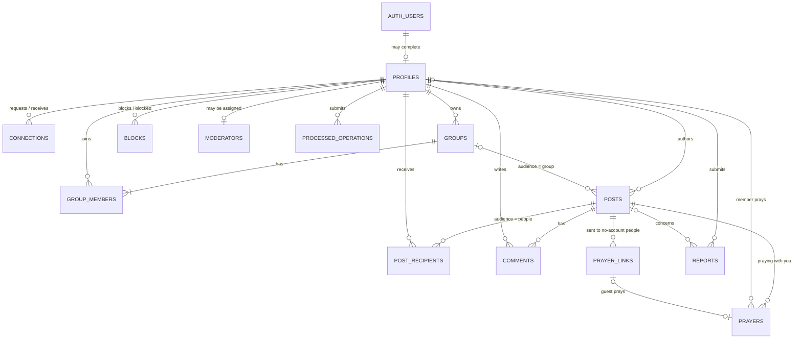
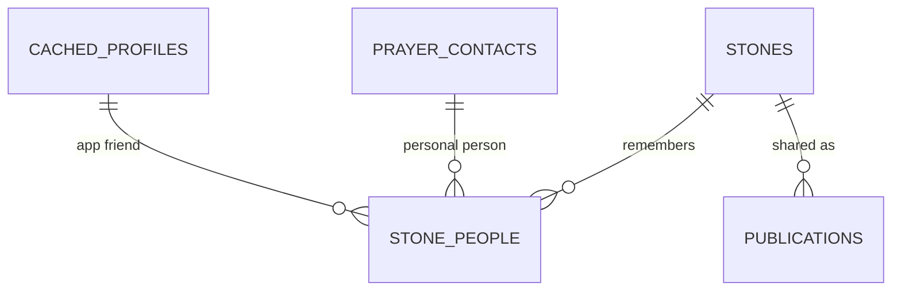

# Community data model and schema organization

Decision date: October 6, 2026. This is the implementation design for the first Together release. It supersedes the provisional ER model in the Together checklist. This document does not create tables or change the hosted database.

Current state (October 6, 2026): profiles are deployed to the hosted project. The community tables and functions are implemented in `supabase/migrations/20261006210000_create_community.sql` and applied **locally only**. To deploy them, run `pnpm exec supabase db push` against the hosted project. Tested: 38 pgTAP permission checks (`supabase/tests/database/community.test.sql`) and a three-account end-to-end Node integration test (`apps/api/test/integration/community.integration.test.ts`). Not yet built: blocks, moderator review of reports, archived groups and ownership transfer.

## 1. Storage boundaries

| Location                      | Responsibility                                                                               | API exposure                                                                                                         |
| ----------------------------- | -------------------------------------------------------------------------------------------- | -------------------------------------------------------------------------------------------------------------------- |
| Supabase `auth`               | Managed accounts, identities, credentials and sessions.                                      | Supabase Auth endpoints; never expose this schema through the Data API or manage passwords in our tables.            |
| PostgreSQL `ebenezer_api`     | Profiles, connections, groups, memberships, published posts and permitted interactions.      | Explicitly expose this schema to the Data API; grant only required operations and enable RLS on each table.          |
| PostgreSQL `ebenezer_private` | Mutation retry records, moderation reports, moderator assignments and authorization helpers. | Keep outside exposed schemas; access only through narrowly authorized functions or controlled maintenance.           |
| PostgreSQL `public`           | Platform objects already there; application profiles have moved out.                         | Move application objects to `ebenezer_api`/`ebenezer_private`; do not drop the schema or unrelated platform objects. |
| Device IndexedDB              | Private stones, reflection drafts, local profile preferences and personal prayer contacts.   | No automatic upload. Downloaded community data and pending publications use separate account-scoped stores.          |

The `ebenezer_api` name identifies the application's exposed database surface; it does not make rows publicly readable. A hidden schema cannot be queried using the same REST `.from()` calls as an exposed schema. Keep the Data API enabled because Node's repositories use it with the signed-in user's JWT. Dedicated schemas, grants and RLS are complementary controls. See [Supabase Data API security](https://supabase.com/docs/guides/api/securing-your-api) and [custom schemas](https://supabase.com/docs/guides/api/using-custom-schemas).

React uses Supabase directly for authentication. Application CRUD follows React → Node routes/authentication → controller → service → repository → Supabase Data API/PostgreSQL. Node verifies identity through Supabase Auth and uses a separate user-scoped client for each request. Direct Data API callers must be subject to the same database rules; frontend or Node validation alone is insufficient.

## 2. Relationships

An account can exist before the person creates a community profile. Its profile uses the same ID as `auth.users.id`, not a second generated identity. Supabase owns account credentials; the profile contains application details. See [Supabase user data](https://supabase.com/docs/guides/auth/managing-user-data).

Revised October 6, 2026 for the Together board: posts can reach **everyone signed in**, a group, or chosen friends; groups are **open** (anyone can join) or **private** (invite-only); and people without an account (Mom) can answer a prayer request through a **private prayer link**.

All tables above live in `ebenezer_api` except `REPORTS`, `MODERATORS` and `PROCESSED_OPERATIONS`, which live in `ebenezer_private`.

A post has exactly one audience:

| `audience`  | Who can read it                                         | Extra rows              |
| ----------- | ------------------------------------------------------- | ----------------------- |
| `community` | Every permanent signed-in member (not the open web).    | None.                   |
| `group`     | Active members of `group_id`.                           | None.                   |
| `people`    | Author plus nonrevoked `post_recipients` (app friends). | `post_recipients` rows. |

Any post may also carry `prayer_links`. That is how a prayer request reaches Mom, who has no account: the author sends her the link through WhatsApp, SMS or email. Opening it shows only that request and lets her answer “I prayed for you” with an optional short note. Personal contacts are still never rows in `profiles` or `post_recipients`, and their phone numbers and email addresses never reach the server.

### Why this shape is efficient

- **One `posts` table for every kind and audience.** Experiences, shared stones and prayer requests share one feed query, one cursor format and one set of permission rules. The board does not union separate tables.
- **Index-backed feed branches.** The feed function merges three small keyset scans, each served by its own partial index: the community branch, the viewer's active groups and the viewer's direct grants. A single `OR` filter evaluated row by row under RLS would be slower.
- **Denormalized counters.** `posts.prayer_count`, `posts.comment_count` and `groups.member_count` are updated by triggers in the same transaction as the row change. A board card never runs `COUNT(*)`.
- **One `prayers` table for members and guests.** It replaces the earlier `prayer_reactions`. A member's prayer and Mom's link answer are both rows, so “Hannah and Mom are praying” and the counter come from one source.
- **Groups have no separate owner flag.** The effective owner is `groups.owner_id`. `group_members.role` holds only `admin` or `member`, so ownership cannot be recorded in two places that disagree.

## 3. Tables and constraints

All cloud IDs are UUIDs. Use `timestamptz` for server-owned UTC timestamps. User references point to `ebenezer_api.profiles.id`, which references only the managed `auth.users` primary key. Add foreign-key lookup indexes and explicit delete behavior in each migration.

| Table                                   | Key fields                                                                                                                                                                                  | Required rules                                                                                                                                                                                                                                                                                                                                                                                                                                                             |
| --------------------------------------- | ------------------------------------------------------------------------------------------------------------------------------------------------------------------------------------------- | -------------------------------------------------------------------------------------------------------------------------------------------------------------------------------------------------------------------------------------------------------------------------------------------------------------------------------------------------------------------------------------------------------------------------------------------------------------------------- |
| `ebenezer_api.profiles`                 | `id` PK/FK to `auth.users.id`, `display_name`, unique `handle`, `created_at`, `updated_at`                                                                                                  | Preserve current limits: trimmed name 1–120 characters; lowercase handle matching `^[a-z0-9][a-z0-9_]{2,29}$`. Account ID and timestamps are not editable. No email, phone or precise location in this table.                                                                                                                                                                                                                                                              |
| `ebenezer_api.connections`              | `id` PK, `requester_id`, `recipient_id`, `status`, timestamps                                                                                                                               | Status `pending/accepted`; no self-requests; unique unordered pair using `least`/`greatest`. Participants are immutable. Only recipient accepts; either participant removes. Decline/cancel removes the pending row.                                                                                                                                                                                                                                                       |
| `ebenezer_api.groups`                   | `id` PK, `owner_id`, `name`, `description`, `visibility`, optional `meeting_note`, `member_count`, `archived_at`, `version`, timestamps                                                     | Name 1–120, description up to 2,000, meeting note up to 200 characters (“Saturdays 8pm on video”). Visibility `open/private`. Open groups appear in discovery (name, description, meeting note, member count only) and can be joined directly. Private groups are invite-only. Owner must have an active membership. `member_count` is trigger-maintained.                                                                                                                 |
| `ebenezer_api.group_members`            | Composite PK `(group_id,user_id)`, `role`, `status`, `invited_by`, `joined_at`, timestamps                                                                                                  | Stored role `admin/member`; status `invited/active`. Effective owner comes from `groups.owner_id`. Joining an open group creates an `active` row through `join_group`; private groups require an invitation. An invitation grants no group-content access. Index `(user_id,status)`.                                                                                                                                                                                       |
| `ebenezer_api.posts`                    | `id` PK, `author_id`, `kind`, `audience`, nullable `group_id`, `body`, optional `scripture`, optional `stone_details`, `prayer_count`, `comment_count`, `version`, timestamps, `deleted_at` | Kind `experience/stone/prayer_request`; audience `community/group/people`. `check ((audience = 'group') = (group_id is not null))`. Body 1–4,000 characters. Stone posts require a Scripture snapshot. Counters are trigger-maintained and not client-writable. Partial feed indexes: `(created_at desc,id desc) where audience='community' and deleted_at is null`, `(group_id,created_at desc,id desc) where deleted_at is null`, `(author_id,created_at desc,id desc)`. |
| `ebenezer_api.post_recipients`          | Composite PK `(post_id,user_id)`, `granted_at`, `revoked_at`                                                                                                                                | People posts only; require at least one accepted, unblocked friend **or** at least one prayer link at publication; author is not a recipient. Removal/blocking permanently revokes the old grant. Index `(user_id,post_id) where revoked_at is null`.                                                                                                                                                                                                                      |
| `ebenezer_api.comments`                 | `id` PK, `post_id`, `author_id`, `body`, `version`, timestamps, `deleted_at`                                                                                                                | Body 1–2,000 characters. Author and parent post are immutable. Read/write access depends on current parent-post visibility.                                                                                                                                                                                                                                                                                                                                                |
| `ebenezer_api.prayer_links`             | `id` PK, `post_id`, `token_hash` (unique), `label`, `expires_at`, `revoked_at`, `created_at`                                                                                                | Created by the post author only, for a person without an account. The raw 256-bit token is returned once and only its SHA-256 is stored. `label` is the author's private name for the recipient (“Mom”, up to 120 characters) and is readable by the author only. No phone/email. Default expiry 14 days, maximum 30. Column grants never expose `token_hash`.                                                                                                             |
| `ebenezer_api.prayers`                  | `id` PK, `post_id`, nullable `user_id`, nullable `prayer_link_id`, optional `note`, `created_at`                                                                                            | `check (num_nonnulls(user_id, prayer_link_id) = 1)`. Unique `(post_id,user_id)` and unique `(prayer_link_id)`: one prayer per member or link, and repeating it updates the note. Note up to 500 characters. Members add/remove their own row while the post is visible. Guest rows are written only by `answer_prayer_link`. The post author sees guest labels; other viewers see only member names and the count.                                                         |
| `ebenezer_api.blocks`                   | Composite PK `(blocker_id,blocked_id)`, `created_at`                                                                                                                                        | No self-block; blocker manages their own rows. Checks treat either direction as blocked. Do not expose someone else's block list.                                                                                                                                                                                                                                                                                                                                          |
| `ebenezer_private.reports`              | `id` PK, `reporter_id`, nullable `post_id`, `reason`, `status`, timestamps                                                                                                                  | Reason code plus optional detail up to 2,000 characters; status `open/reviewed/resolved`. Submission derives reporter from identity. Reporter can receive a submission receipt; report contents are reserved for authorized moderation.                                                                                                                                                                                                                                    |
| `ebenezer_private.moderators`           | `user_id` PK/FK, `created_at`                                                                                                                                                               | Provisioned through trusted administration, never from editable profile/user metadata. Assignment cannot be self-created.                                                                                                                                                                                                                                                                                                                                                  |
| `ebenezer_private.processed_operations` | Composite PK `(actor_id,operation_id)`, `action`, `request_hash`, `result_id`, `created_at`                                                                                                 | Retry receipt committed with its mutation. Same operation/payload returns the same reference; same operation/different payload is rejected. No private journal body or authorization-bypassing cached response.                                                                                                                                                                                                                                                            |

`scripture` is a published, approved snapshot with reference, translation, text and canonical source identification. It is content, not a relational foreign key to an embedding result. Validate it against the trusted Bible source before publication; a client's claimed quotation is not enough. No embeddings or model output belong in account tables.

`stone_details` contains only explicitly previewed tone/reflection fields, with bounded keys and values. It excludes raw check-in text, contact phone/email, the full draft, local account/storage metadata and unrelated journal answers. A `shared_posts` row has no SQL foreign key to a device-only stone. A separate local publication link records the account, local stone ID and cloud post ID.

Group name/description and post/comment edits use increasing server versions and an expected-version check. Comments use `(post_id,created_at,id)`. Use stable `(created_at,id)` feed cursors and page sizes of at most 30.

The board feed is one `security invoker` SQL function, `ebenezer_api.feed(before_created_at, before_id, page_size, filter_kind)`. Each branch takes the newest `page_size` rows before the cursor from its own partial index: community posts, posts in the viewer's active groups and posts granted to the viewer. The function merges the branches, drops blocked authors, sorts, and returns `page_size` rows with `viewer_prayed` (an `EXISTS` on the `prayers` unique key) and author `handle`/`display_name`. The cost stays proportional to the page size, not the table size.

## 4. Access decisions

Require a permanent signed-in Supabase user for all community operations. A token issued to an anonymous Auth user does not qualify. Creating a community profile is explicit after sign-in; a missing profile routes to setup. Local stones remain usable without an account.

Enforce this requirement in database policies/functions as well as Node: Supabase anonymous Auth users also have the `authenticated` role, so a role grant alone does not establish a permanent account. Include anonymous-Auth cases in permission tests; the current Node gateway already rejects them.

| Resource                      | Read permission                                                                                                                                                                                   | Write permission                                                                                                                                                                                            |
| ----------------------------- | ------------------------------------------------------------------------------------------------------------------------------------------------------------------------------------------------- | ----------------------------------------------------------------------------------------------------------------------------------------------------------------------------------------------------------- |
| Full profile                  | Owner only.                                                                                                                                                                                       | Owner updates display name/handle; existing column grants protect identity/timestamps.                                                                                                                      |
| Minimal profile identity      | An authenticated exact-handle lookup, or a permitted friend/group/post context; return only ID, handle and display name. Apply block rules.                                                       | No independent editable directory copy.                                                                                                                                                                     |
| Connections                   | The two participants.                                                                                                                                                                             | Requester creates/cancels; recipient accepts/declines; either removes accepted connection.                                                                                                                  |
| Groups and roster             | Active members. Any member may see an open group's discovery card (name, description, meeting note, count) and join it. Invitees see only their own invitation and minimal group/inviter details. | Owner manages ownership/archive; owner/admin edits details and invites/removes ordinary members. Only owner appoints/removes admins.                                                                        |
| Membership                    | Your own invitation, or roster of an active group you belong to.                                                                                                                                  | User accepts/declines their invitation or leaves; authorized owner/admin manages others. Owner transfers ownership or deletes the group before leaving.                                                     |
| Posts                         | `community`: any permanent member. `group`: active group member. `people`: author or nonrevoked recipient. Withdrawn posts are unavailable. Apply author/viewer block rules.                      | Author publishes/edits/withdraws; authorized moderators may withdraw through a separate audited action.                                                                                                     |
| Comments/reactions            | Visible parent post; omit contributions from blocked users.                                                                                                                                       | Comment author manages their comment while parent remains visible; reaction owner manages their reaction. Group owner/admin may remove comments only inside their own group through an authorized function. |
| Prayer links                  | Author only (label, expiry, answered state). A guest holding the raw token can read only that post's body, Scripture and author display name through `open_prayer_link`.                          | Author creates/revokes. A guest answers through `answer_prayer_link(token, note)`. Expired or revoked links, and links on withdrawn posts, return the same not-found result.                                |
| Blocks                        | Blocker only.                                                                                                                                                                                     | Blocker adds/removes their block through a function that also revokes affected connections/direct grants.                                                                                                   |
| Reports/moderator assignments | Trusted moderator function only; report submission returns a receipt, not all reports.                                                                                                            | Authenticated report submission; moderator review; assignments only through trusted administration.                                                                                                         |
| Operation records             | Internal mutation implementation only.                                                                                                                                                            | Written atomically with the matching mutation.                                                                                                                                                              |

Minimal identity lookup does not grant SELECT on every full profile row. Start with exact normalized handle lookup, bounded results and no email/phone lookup. Use a narrowly authorized function and context-specific summaries for names on friends, invitations, rosters and posts. Avoid accidentally exposing profile timestamps or future private columns through a general directory view.

Because `community` posts reach strangers, reports, moderator removal and blocking must ship **before** the community audience is enabled, not after. A new account's first community posts may be rate-limited per day in Node and in the publishing function.

Active group members can read the group's existing, nonwithdrawn history, including posts published before they joined. Removal stops server access immediately. Rejoining restores permitted group history; this differs from direct sharing, where revoked old grants stay revoked after reconnecting. Archived groups remain readable by active members but reject new posts/interactions and invitations until the owner restores them. Leaving, authorized member removal and ownership transfer still work while archived.

Blocking hides content between the pair and stops direct sharing/interactions. Shared group membership is not automatically removed by blocking; membership management still follows group roles. A user can leave a shared group. On learning a block/removal/withdrawal, discard unauthorized cached community records. Offline devices cannot immediately learn a server permission change.

## 5. Database-enforced mutations

Use transactional functions in `ebenezer_api` for mutations involving multiple rows or role/audience transitions. Examples: `feed`, `create_group`, `join_group` (open groups only), `respond_to_invitation`, `transfer_group_ownership`, `respond_to_connection`, `remove_connection`, `block_person`, `publish_post`, `withdraw_post`, `create_prayer_link`, `submit_report` and `review_report`.

`open_prayer_link(token)` and `answer_prayer_link(token, note)` are the only functions the `anon` role may execute. Each is `SECURITY DEFINER` with an empty search path, hashes the token, and checks expiry, revocation and post withdrawal. Each returns only the request text, its Scripture and the author's display name, never handles, other prayers or IDs. Node exposes them at unauthenticated `/v1/prayer-links/:token` routes with per-IP rate limits. A direct Data API caller still needs the 256-bit token.

- Derive the actor from `auth.uid()` and verified account status, never a submitted actor ID.
- Require the relevant membership/ownership/connection before changing rows. Lock affected rows consistently so accepting an invitation, leaving a group or blocking cannot race past a publication authorization check.
- Creating a group and its active owner membership is one transaction. A deferred database constraint trigger must enforce the active-owner invariant even when internal maintenance changes rows.
- Creating a direct post, nonempty recipient set and retry receipt is one transaction. Explicit audience edits validate the entire replacement audience and revoke removed grants atomically.
- Removing a connection or blocking revokes direct grants in both directions. Unblocking does not restore them. Group membership revocation is also transactional.
- Use least-privilege table/column grants. Complex mutation tables are readable through RLS but not freely writable with raw REST insert/update/delete; expose only the authorized mutation functions needed for these transitions. The profile endpoint can retain its tested column-limited direct writes.
- Prefer invoker functions when possible. Any required `SECURITY DEFINER` function has a fixed empty search path, fully qualified references, explicit role checks and tightly limited EXECUTE grants. Revoke default PUBLIC execution. Enable RLS on `ebenezer_private` records as defense in depth and grant no direct application-role table access there.
- Keep reusable visibility helpers in `ebenezer_private`, returning only authorization booleans. Permit execution only where policies/functions need it. They must resolve their actor from the session and avoid recursive membership/recipient RLS loops.
- Resolve retry receipts before returning, but recheck current visibility; an old mutation receipt must not reveal withdrawn content or override a changed permission. Idempotency does not confer access.

These functions are part of repository access, not an alternative service layer. Node services still handle the application's behavior, controllers validate HTTP contracts, and PostgreSQL protects invariants against direct Data API callers.

## 6. Deletion and local history

- Profile FK to `auth.users.id`: preserve `ON DELETE CASCADE`. Other user references cascade participant-owned connections, memberships, direct grants, reactions, blocks and authored posts/comments when a profile is removed.
- Group ownership FK: `ON DELETE RESTRICT`. Before deleting an owning account/profile, transfer or explicitly delete its groups, including archived groups. This prevents ownerless groups or accidental deletion of everybody's shared history. Do not add account deletion UI until this workflow is implemented.
- Group deletion cascades memberships and group posts; post deletion cascades recipient grants, comments and reactions. Withdrawal normally uses `deleted_at` and denies body access rather than deleting the original local stone.
- Report post reference uses `ON DELETE SET NULL`, so moderation can retain a minimal receipt without retaining a copy of a deleted private/shared body. Reporter/moderator references follow the account lifecycle. Define operational retention before moderation goes live.
- Retry records may cascade with their actor. Retention must cover the permitted retry window; keep receipts for the initial demo rather than pruning while queued publications might retry.
- Account removal, sign-out, friendship removal and cloud-post withdrawal do not delete the existing device-only journal. Local name snapshots keep old stone memories readable when a person/contact is unavailable.

## 7. Personal prayer contacts remain separate

Mom can be a local `prayer_contacts` entry with a contact UUID, display name, optional relationship and explicitly entered messaging method. She needs no Supabase account. When the signed-in author asks her to pray, Node creates a `people` prayer-request post with a `prayer_links` row labeled “Mom”. The external message carries the link, and Mom's answer appears to the author as a guest prayer. Her phone number stays on the device. Unsigned-in or offline, the request falls back to message text only, with no link. These records do not belong in `auth.users`, `ebenezer_api.profiles` or `ebenezer_api.post_recipients`.

Local `stone_people` associations reference either a contact UUID or a real app profile ID, and retain a historical display-name snapshot plus the user's prayer intention. These are IndexedDB relations, not SQL foreign keys across devices. A contact can be remembered without messaging. Opening SMS/WhatsApp/email is a handoff, never proof that a message was sent or prayer happened.

On-device tables (Dexie version 3, added without touching existing stores):

| Store            | Key / indexes                  | Fields                                                                                                                       |
| ---------------- | ------------------------------ | ---------------------------------------------------------------------------------------------------------------------------- |
| `prayerContacts` | `id`; `accountId`, `deletedAt` | `displayName`, optional `relationship`, `channel` (`whatsapp/sms/email/share`), optional `phone`/`email`, timestamps.        |
| `stonePeople`    | `id`; `stoneId`, `personId`    | `kind` (`contact/member`), `personId`, `nameSnapshot`, `intent` (`would_like/asked/prayed_together`), optional `recordedAt`. |
| `publications`   | `id`; `stoneId`, `postId`      | `accountId`, `stoneId` or `null` for a standalone post, cloud `postId`, `audience`, `createdAt`. No body copy.               |

The remaining contact screens are described in the personal contact plan. Their storage boundary is decided; see [the personal prayer contact plan](./prayer-people-plan.md). Contact cloud backup and private journal synchronization are separate opt-in features with their own later models.

## 8. Profile move: completed migration and reproduction steps

The original `20261006173603_create_profiles.sql` is unchanged. The move is implemented in `20261006185220_organize_ebenezer_schemas.sql`, tested locally, then deployed. The steps below describe this coordinated migration.

1. Create `ebenezer_api` and `ebenezer_private` with explicit schema privileges and deny-by-default object privileges. Expose `ebenezer_api` in local `supabase/config.toml` and the hosted project's Data API settings; keep `ebenezer_private` and `auth` unexposed.
2. Move the existing table using `ALTER TABLE public.profiles SET SCHEMA ebenezer_api`. This preserves its rows and IDs; do not drop/recreate or export/reimport it. Move its timestamp trigger function to `ebenezer_private`, preserving the trigger binding and restricted privileges.
3. Assert the FK, unique/check constraints, indexes, grants, RLS enabled flag, all three owner policies and trigger after the move. Schema usage must permit the authenticated operations, while unauthenticated table access stays denied. Preserve ownership checks and explicitly restrict policies to permanent accounts, matching the Node gateway; test anonymous Auth tokens separately from unsigned-in requests.
4. Regenerate types for `ebenezer_api,ebenezer_private`; adapt the shared user-scoped client type/configuration, profile row types, repositories, test clients and fixtures to `ebenezer_api`. Keep `/v1/me` and its JSON contracts unchanged.
5. Run migration-preservation tests with an existing profile, all permission tests, and real two-account integration tests. Assert unchanged row IDs/values, failed cross-user/anonymous access and working timestamp updates.
6. Review the hosted dry run, coordinate migration with the backend schema configuration, apply, then verify `/v1/me` with a real authenticated session. Moving a table without switching the repository's default schema would break reads; this is one coordinated release.
7. Verify application dependencies before removing `public` from exposed schemas. Keep the PostgreSQL schema itself. Do not leave a compatibility view that accidentally grants wider access.

Exposing a schema in local config does not configure the hosted project automatically. Node clients now explicitly default to `ebenezer_api` through the shared schema/client type. The partial hosted config in `supabase/hosted-api/supabase/config.toml` deploys only Data API settings; it leaves undeclared Auth settings unchanged. No application-wide service-role key is needed for these normal requests.

## 9. Implementation order and acceptance checks

Step 1 and the React implementation of step 2 are complete. Enable the Google provider and run the hosted two-account acceptance test before starting connections/groups. Hosted schema/access probes already pass.

| Order | Deliverable                                                                                           | Completion evidence                                                                                                                                  |
| ----- | ----------------------------------------------------------------------------------------------------- | ---------------------------------------------------------------------------------------------------------------------------------------------------- |
| 1     | Schema move only: `ebenezer_api.profiles`, private trigger helper, updated config/types/repositories. | Old profile data preserved; permission and integration tests pass locally; coordinated hosted verification.                                          |
| 2     | React sign-in using Supabase Auth, callback, session refresh, sign-out and explicit profile setup.    | Two independent accounts load/save only their own profile through Node; expired sessions fail; local journal still opens signed out/offline.         |
| 2b    | Local `prayer_contacts`, `stone_people` and the journey's Together picker (no server needed).         | Mom can be added, chosen on a stone and messaged offline; old drafts/backups still open.                                                             |
| 3     | Connections, minimal identity lookup, blocks and associated functions.                                | Pending requests grant no post access; only recipient accepts; removal/blocking revokes old direct grants.                                           |
| 4     | Open and private groups, discovery, joining, invitations, membership and ownership functions.         | Group creation is atomic; invitee/nonmember cannot read content; self-promotion fails; last-owner removal fails without transfer/delete.             |
| 5     | Posts (`group`/`people` audiences), prayer links and guest answers, recipients and retry records.     | Field whitelist enforced; both audiences work; duplicate retry creates one post; changed-payload retry fails; no local stone is uploaded implicitly. |
| 6     | Feed function, comments, prayers, reports and moderation; then enable the `community` audience.       | Three-account access tests, block/withdrawal propagation and role checks pass before wider community use.                                            |

Sign-in uses Google through Supabase Auth. Hosted development callback settings are configured; provider credentials must still be entered in the Dashboard. Supabase manages login/session credentials; Node is not a second authentication system. Sign-in alone does not generate a handle or copy local data into a community profile.

Only create each phase's tables when its behavior, grants, constraints and tests are ready. Do not add unused cloud `stones`, address-book tables, chat, notifications or sync tables in this community milestone.
