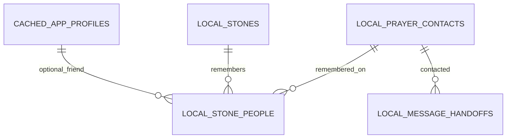

# My People: app friends and personal prayer contacts

Proposed design, October 6, 2026. This refines [the Together checklist](./together-community-plan.md); the contacts and messaging features below are not implemented yet.

## What the existing files do

`apps/web/index.html` is the React entry document; it mounts `src/main.tsx` and contains no contact or messaging logic.

The preserved `legacy/original-pwa/index.html` contains the relevant prototype:

- `CFG.people`/`PEOPLE_()` stores names and relationship notes; settings lets a person add/remove people without accounts.
- `stepTogether()` (around line 558) lets someone select multiple names into `P.with` and builds a prayer-request message from the selected Scripture and prayer note.
- Its `sms:?&body=...` link leaves the recipient unspecified. Selecting Mom changes the greeting, but does not direct the message to Mom's phone.
- The click handler sets `P.asked=true` immediately. The later stone saves `with` only when that flag is true, although opening an external composer does not establish that a message was sent.
- `renderTogether()` (around line 654) shows My People with similar generic Message links.

Keep the personal-circle idea, multiple prayer partners and a prepared message. Replace name-based identity, generic recipient targeting and automatic sent/asked claims.

## One circle, two kinds of person

| Kind                    | How added                           | Where kept initially                                  | What they can do                                                                                                                                                  |
| ----------------------- | ----------------------------------- | ----------------------------------------------------- | ----------------------------------------------------------------------------------------------------------------------------------------------------------------- |
| Friend on Ebenezer      | Find a handle, send request, accept | Supabase profiles/connections; authorized local cache | Receive an app-shared post, participate in groups and use community reactions/comments.                                                                           |
| Personal prayer contact | Add someone I know                  | Private IndexedDB contact store                       | Be remembered on a private stone and contacted through the owner's messaging/email apps. No account is needed for either person to use the local-contact feature. |

My People combines both in one view with optional filters. Do not treat a personal contact as a pending app friend or automatically invite them when they are added. They have no access to the journal/feed just because their name is saved. They can receive the text explicitly sent through an external app.

Suggested actions: **Find an Ebenezer friend** and **Add someone I know**.

## Welcoming contact creation

Use the common DialogModalLayout and FormBuilder, with short conversational prompts:

1. **What do you call them?** — Mom, Hannah, Pastor Mark. Required display name.
2. **Who are they to you?** — Mother, friend, mentor. Optional relationship.
3. **How would you like to reach them?** — WhatsApp, text message, email or choose an app when messaging.
4. Ask for the necessary phone number or email only when that channel is chosen. A name-only contact remains valid.

Phone numbers include country calling codes; validate/normalize numbers before building channel links. Store data, not arbitrary executable contact URLs. Adding a contact never sends a message.

Manual entry is the first implementation. Device address-book selection can be a later enhancement, not a required step: Contact Picker support is limited and requires explicit selection/permission. Do not upload the phone's address book.

## Mom's journey

1. In My People, choose Add someone I know and save Mom, Mother and an optional preferred channel/number.
2. In the journey's Together moment, tap Mom under **Who would you like beside you in prayer?** A friend on Ebenezer can appear alongside her.
3. This selection is enough to remember her on the private stone; messaging is optional.
4. Tap **Message Mom** to open a common prayer-message preview. The suggested message uses the Scripture reference and an optional, explicitly selected prayer request. It is editable before leaving Ebenezer.
5. Choose Open WhatsApp/Open Messages/Open email, or Choose an app/Copy message.
6. Finish sending in the external app. On returning, optionally select **I asked Mom to pray** or **We prayed together**. These are personal, self-reported records, not delivery receipts.
7. Set the stone. Reopening it shows Mom's saved name and relationship, the personal prayer state and a Message action if the contact still exists. No phone/email is printed on the stone.

Possible private stone descriptions:

- “I’d like Mom to pray with me.” — selected, no claim of contact yet.
- “I asked Mom to pray.” — recorded by the user.
- “Mom and I prayed together.” — recorded by the user.

Selecting someone and sending a message are distinct actions. Choosing someone does not publish the stone, create a community post or force account creation. If several people are selected, message them separately by default; never expose everyone's numbers through an automatically created group conversation.

## Messaging behavior

| Action        | Behavior                                                                                                                                                                                              |
| ------------- | ----------------------------------------------------------------------------------------------------------------------------------------------------------------------------------------------------- |
| WhatsApp      | With a saved number, open the official click-to-chat URL with an encoded, previewed message. The external app/account and connectivity still need to work.                                            |
| Text message  | With a saved number, attempt a recipient-addressed SMS composer. URI/body behavior varies by platform, so test physical iPhone/Android and retain Copy/Choose an app fallbacks.                       |
| Email         | With a saved address, open a prefilled `mailto:` composer; the user completes sending in their mail app.                                                                                              |
| Choose an app | Use `navigator.share()` when supported and on an explicit click. The system lets the user choose an app/recipient; Ebenezer cannot force the selected contact as recipient.                           |
| Copy message  | Copy only the approved text, with a selectable-text fallback if clipboard access is unavailable.                                                                                                      |
| App friend    | Publish an intentional direct prayer post through Node to an accepted connection. Server acceptance establishes that the request was stored for that audience, not that the person read it or prayed. |

Opening a composer or resolving the Web Share promise never sets “sent”, “delivered” or “asked” automatically. Do not fall back to a different app after the user cancels sharing. It is enough to keep the person's selection and offer a retry.

No paid WhatsApp Business API, SMS gateway or automated email delivery is needed for personal messaging. The user's chosen app performs delivery. Contacts, message preparation and stones work offline; actual delivery depends on the external app's internet/cellular capabilities. Do not queue an automatic external message for sending later.

An external recipient can read the shared text without Ebenezer. Do not send a localhost URL, inaccessible private stone link or automatic public link. Decided October 6, 2026: when signed in and online, the author may include a **private prayer link** (a per-person, expiring token for one prayer request, never the stone). Mom can open it without an account and answer “I prayed for you”. That answer is the only “prayed” fact the app records automatically, because Mom created it. Opening a composer still records nothing. See `prayer_links` and `prayers` in the [community data model](./community-data-model.md). Default messages exclude journal answers, check-in text, contact lists and phone numbers.

## Data model and ownership

Supabase `profiles` and `connections` remain the app-friend model. A personal contact has a device-generated contact UUID, never a fabricated `auth.users` ID. Keep personal contacts local for the initial release; private cloud backup of contacts can be a later, separately chosen feature.

| Local entity       | Proposed fields                                                                                                                                                                                                         |
| ------------------ | ----------------------------------------------------------------------------------------------------------------------------------------------------------------------------------------------------------------------- |
| `prayer_contacts`  | `id`, local/account scope, `displayName`, optional relationship, phone/email, preferred channel, timestamps, optional deletion marker.                                                                                  |
| `stone_people`     | Local relation ID or compound key, `stoneId`, kind `personal/app`, typed contact/user ID, saved display-name/relationship snapshot, intent `would_like_prayer/asked/prayed_together`, optional user-recorded timestamp. |
| `message_handoffs` | Optional bounded history: ID, scope, contact/user ID, stone/draft reference, channel, attempt/opened timestamp. Never a delivery receipt or a copy of all message contents.                                             |

Each stone-person row references either a personal contact or app profile, not both. These are IndexedDB relationships enforced through typed repositories/transactions, not SQL foreign keys across a device and Supabase. If a contact/profile is deleted or unavailable, preserve the historical name snapshot and disable the old direct-contact action or offer generic message sharing. Do not reconstruct deleted phone numbers from stone snapshots. Editing a person's current name does not rewrite previous stone memories.

Add contacts and stone associations through a versioned IndexedDB migration; do not replace the journal database. Save the stone and associations atomically. Drafts retain selected people and their intended prayer states across Back, reload and language changes. Preserve the legacy `partner` string as a historical label; do not split it into imaginary accounts/numbers or discard it. New optional contract fields keep old stones/backups readable. Expand backup format explicitly if exporting the separate contact store, allowing the user to exclude contact methods; a stone name snapshot does not require an exported address book.

Personal phone/email records and stone-person associations are never included automatically in community posts. Public sharing remains an explicit field whitelist. Optional future contact cloud tables must have owner-only RLS and must not participate in public profile search. Linking a personal contact to an existing app friend later requires a deliberate choice, not phone/email matching or automatic promotion.

## Common-component architecture

Feature modules/repositories own contacts, selected people, draft saving and message preparation. Common UI components compose the existing Button, Card, FormBuilder and DialogModalLayout:

- `PersonCard` — renders either kind of person with translated actions.
- `PrayerPeoplePicker` — selects remembered prayer companions; selecting does not message them.
- `PersonalContactDialog` — common form and modal for creating/editing personal contacts.
- `PrayerMessageDialog` — always-visible editable preview and channel actions.
- `StonePeople` — historical names/prayer records plus explicit message callbacks.

URL/message helpers live in a small `lib/contact-messaging.ts`; channel handoff behavior belongs in a feature hook. No contact database calls in common visual components. All labels/errors/accessibility strings use bundled i18n. No Zustand or Redis is required for this scope.

## Added implementation checklist

- [ ] Implement shared typed personal-contact and prayer-companion schemas, preserving the legacy partner label.
- [ ] Add local migrations/repositories for personal contacts and stone-person relations, including scoped data and atomic stone saving.
- [ ] Build Add/Edit/Remove someone I know, alongside accepted app friends in My People.
- [ ] Integrate an always-available common people picker into Together; save selected companions even without messaging.
- [ ] Add editable message previews and safe channel links, generic sharing and copy fallbacks.
- [ ] Record only handoff facts automatically; prayer-request/prayed-together states remain explicitly user-recorded.
- [ ] Display saved companions and Message actions in stone details; preserve historical names after contact deletion.
- [ ] Extend draft/backup compatibility without publishing or auto-uploading contacts.
- [ ] Test external cancellation, unsupported sharing, no destination number, invalid phone/email, multiple recipients, deleted contacts, language changes and offline reload.
- [ ] Test real SMS/WhatsApp/email handoffs on iPhone, Android and desktop; desktop handlers and share targets vary.
- [ ] Test that personal contacts cannot become a Supabase post recipient or public profile unless explicitly linked to an accepted real app friend.

Done when: Mom can be added without an account, remembered on an offline stone, and messaged intentionally; app friends and groups still have proper authenticated community sharing.

## References

- [MDN Web Share](https://developer.mozilla.org/en-US/docs/Web/API/Navigator/share): feature detection, secure context/user activation, device-selected destinations and platform-dependent promise resolution.
- [WhatsApp click to chat](https://faq.whatsapp.com/5913398998672934): recipient phone number in international format and prepared-message links.
- [MDN Contact Picker](https://developer.mozilla.org/en-US/docs/Web/API/Contact_Picker_API): limited availability and explicit access; manual entry remains the baseline.
