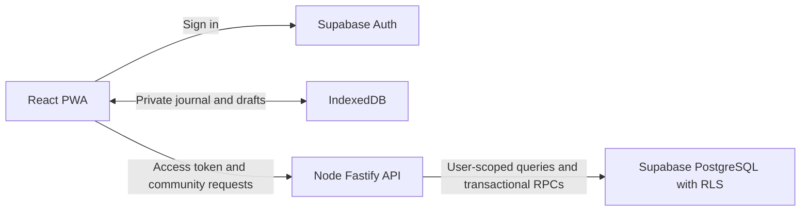

# Together: Supabase and Node development checklist

Planning date: October 6, 2026. This is a proposed implementation checklist, not completed backend functionality.

## Current starting point

- React/Vite, TypeScript, Tailwind and bundled English/Spanish are implemented.
- Shared UI lives in `apps/web/src/components/ui/`. Feature modules own behavior; common components own rendering/styles. FormBuilder and DialogModalLayout are already available.
- The five-moment journey is Feel → Read → Reflect → Together → Stone. Together currently records an optional name; it does not send messages.
- `/community` is a preview. Node/Fastify exposes `/health` and authenticated `GET /v1/me` / `PATCH /v1/me` through controller/service/repository layers.
- Dexie/IndexedDB stores the private journal and drafts. The hosted Supabase project exists and local environment files contain its URL and publishable key. Profile migration/RLS and Node token verification are implemented and tested locally. The profile migration is deployed to the personal hosted Ebenezer project; React sign-in/profile setup is implemented; Google provider setup, hosted account acceptance tests and community endpoints remain pending.

## Product scope for the first community release

Together becomes a community board with three tabs: **Board**, **Groups** and **My people**. The Board shows experiences, shared stones and prayer requests from everyone signed in, your groups and friends who shared directly with you, newest first, with a “Praying” action and comments. Groups are open (joinable from the board) or private (invite-only). Mom, who has no account, receives prayer requests through a private prayer link. See the [community data model](./community-data-model.md) for the revised ER model. The original plan described Feed, My People and Groups. My People includes both accepted friends on Ebenezer and privately added personal prayer contacts, such as a mother who does not use the application. App friendships require accepted connection requests; personal contacts require no account and can be remembered on stones and reached through an external messaging app. See [My People and personal prayer contacts](./prayer-people-plan.md) for the local ER extension, message behavior and checklist. Groups are private and invite-only initially. A feed shows posts the signed-in person is authorized to see: their own posts, posts shared directly with them and posts in their active groups.

Supported content: shared stones, short encouragement/stories and prayer requests. Start with text and existing Scripture content. A prayer reaction means “I’m praying with you”; no fabricated prayer counts or delivery confirmations.

The journey's Together moment is a lightweight audience picker. It can prepare a sharing intention, but sharing stays optional. Save the private stone locally first, then offer the exact publishing preview. A user can finish a stone while offline, unsigned-in or without sharing. The full Together page also lets them share an existing stone later.

Defer open-web (unsigned-in) feeds, arbitrary direct-message chat, phone address-book import, attachments, push notifications, AI moderation, recommendation algorithms and private cloud-journal synchronization. These are separate features, not prerequisites for the hackathon community.

## Architecture and storage

- Supabase Auth manages accounts and authentication. Do not build password storage in Node.
- React uses Supabase directly for authentication; community CRUD goes through Node.
- Node verifies the access token, derives the actor from it, validates shared Zod contracts and applies the domain rules. PostgreSQL RLS also enforces access, including requests made directly to Supabase's Data API.
- Use a Supabase client scoped to the verified user's JWT for normal Node requests. Never use a global client with mutable user tokens or an unrestricted admin client for routine CRUD.
- Private stones stay in IndexedDB. A published post stores an explicit snapshot of approved fields; it has no foreign key to a device-only stone. Keep the source-stone/publication association locally.
- Editing a private stone does not silently change a published snapshot. Editing or withdrawing a post is a separate action. Withdrawing removes server access to the post, not the private journal; it cannot erase screenshots or disconnected cached copies.
- Cached feed data, pending shares and recipients must be account-scoped. Existing private-journal outbox actions cannot be reused unchanged for publishing.
- Redis is unnecessary for this milestone. IndexedDB supplies device storage; PostgreSQL supplies durable community storage, constraints and retry records. Realtime can be added after ordinary fetch and reconnect are reliable.

## Decided ER model and schema organization

The [community data model](./community-data-model.md) is the source of truth for table fields, relationships, schema boundaries, access rules and deletion behavior. It replaces the earlier provisional model in this checklist.

- Supabase owns `auth` accounts and sessions.
- Application tables will live in the exposed `ebenezer_api` schema, with explicit grants and RLS.
- Internal retry/moderation records and authorization helpers will live in unexposed `ebenezer_private`.
- `ebenezer_api.profiles` and its `ebenezer_private` timestamp helper are deployed through a tested, data-preserving migration. The hosted Data API exposes only `ebenezer_api`.
- Private stones and personal contacts remain in IndexedDB. Published stones are explicit copies.
- The schema move and coordinated repository/config/type updates are complete. React Supabase sign-in/profile setup is implemented; enable Google and complete the hosted account test next. Remaining tables follow feature by feature.

## Ordered implementation checklist

### 1. Supabase project and repeatable setup

Follow the [first Supabase setup guide](./supabase-setup.md). Begin with the project and one authenticated profile feature; the detailed people workflow is deferred.

- [x] Create a Supabase project; choose a suitable region and record its project URL. The user's project is in West US (Oregon).
- [x] Add local Supabase configuration and versioned profile SQL under `supabase/migrations/`. Further community tables are pending.
- [x] Add environment-variable placeholders to `.env.example`; keep actual credentials out of Git. Local web/API `.env` files are configured and ignored by Git.
- [ ] Web: project URL and publishable key only. Node: project URL and publishable key for user-scoped access. Keep any later administrative secret exclusively on the server.
- [x] Configure exact hosted localhost Auth return URLs through a partial configuration. Deployed HTTPS callbacks follow hosting.
- [x] Apply the profile migration to local Supabase first, then to the hosted project; confirm the hosted migration is up to date.
- [ ] Apply later community migrations locally before deploying them. Seed demo groups and content only in the test/demo environment.

Done when: schema can be reproduced from migrations without manually recreating tables in the dashboard.

### 2. Authentication and profiles

- [x] Implement React Google sign-in through Supabase Auth, PKCE callback, refresh, sign-out and failure handling.
- [ ] Enable Google with provider credentials and verify hosted sign-in. See [the setup guide](./google-sign-in-setup.md).
- [x] Keep the journal available without an account; account/profile actions use the signed-in session.
- [x] Implement explicit creation/update of the signed-in person's profile and unique handle through Node. Hosted acceptance testing follows Google setup. Do not create someone else's auth account as an “add person” operation.
- [x] Add Node authentication middleware. Validate tokens using Supabase Auth `getUser(token)` initially; never trust a decoded token or a client-supplied author ID. Tested against real local Auth.
- [ ] Scope/clear downloaded community data on sign-out and account changes; keep existing local-only stones intact.
- [x] Scope in-memory account profiles and cancel pending requests on sign-out/account changes without clearing the local journal. Future feed caches require their own account-scoped implementation.

Done when: two separate accounts have independent identities and an expired session cannot perform a community mutation.

### 3. Tables, permissions and transactional functions

- [x] Decide the ER model, schema organization, access rules and deletion behavior in the [community data model](./community-data-model.md).
- [x] Move the existing profile table to `ebenezer_api` through a new migration; update schema configuration, generated types, repositories and preservation/permission tests together.
- [ ] Implement the remaining model, constraints, indexes and transactional functions feature by feature.
- [ ] Enable RLS and define deny-by-default permissions before connecting community UI.
- [ ] Limit profile discovery to minimal handle/display-name results; never expose auth email addresses.
- [ ] Authors manage their own content; active group members or authorized direct recipients read it. Comments/reactions obey the same visibility and block rules.
- [ ] Implement transactional group creation, publishing and access-revocation RPCs. Enforce rules in PostgreSQL so direct API calls cannot bypass Node.
- [ ] Add a two-user/nonmember permission test suite.

Done when: guessing a UUID or calling Supabase directly cannot reveal another person's private/group/direct content or elevate a role.

### 4. Node structure and shared contracts

- [ ] Add shared Zod request/response schemas to `packages/contracts`.
- [x] Add `apps/api/src/shared/http/auth.ts` and request-scoped Supabase access.
- [ ] Start with `modules/profiles`, then add `people`, `groups`, `posts`, `moderation` as their workflows are implemented. Each has routes for URL registration, a controller for HTTP validation/responses, a service for domain rules, a repository for database/RPC calls, a `types.ts` for its repository interface, an in-memory `*.repository.fake.ts`, and a public `index.ts` registered in `modules/index.ts`.
- [ ] Add cursor pagination, bounded page sizes, consistent errors, optimistic versions and operation IDs on mutations.
- [ ] Restrict CORS to configured frontend origins; redact tokens and personal post bodies from logs. Add request limits without introducing Redis.

Done when: routes contain no duplicated database/business logic and API validation is shared with React.

### 5. My People

- [ ] Find an app user by handle and send a connection request.
- [ ] List incoming/outgoing requests; accept, decline or cancel appropriately.
- [ ] List accepted people; remove or block someone.
- [ ] Add/edit/remove private personal contacts without creating app accounts; follow the [personal prayer contacts checklist](./prayer-people-plan.md).
- [ ] Let either kind of person be remembered on a private stone. Preview and open external messages for personal contacts; direct app posts still require real accepted friends.
- [ ] Avoid fake contacts/default prayer partners and automatic address-book uploads. Opening a message composer is not evidence of sending.

Done when: app friendships require acceptance and removal/blocking revokes direct sharing grants; Mom can also be privately added, remembered and contacted without an Ebenezer account.

### 6. Groups

- [ ] Create, list, view, edit and archive a group with role checks.
- [ ] Invite existing app users; accept/decline invitations.
- [ ] List active members, leave/remove a member and handle owner transfer.
- [ ] Show role-sensitive actions in UI, with server enforcement independent of visibility.

Done when: group creation has an owner membership and nonmembers cannot read the group's posts.

### 7. Shared stones and posts

- [ ] Build a shared publishing composer/preview with a group or selected people as audience.
- [ ] Default a stone share to Scripture and memory; include tone or other reflection fields only when explicitly chosen. Never send the whole private stone object.
- [ ] Create/read/edit/withdraw published posts; do not cascade into private IndexedDB stones.
- [ ] Support short prayer requests and stories through the same typed post model.
- [ ] Record local stone/publication links separately; a later private edit never republishes silently.
- [ ] Make repeated publish requests return the same result using operation IDs; reject an operation ID reused with a different payload.

Done when: the published copy contains only previewed fields and an interrupted retry produces one post.

### 8. Feed, comments and prayer reactions

- [ ] Fetch a newest-first authorized feed with stable `(created_at,id)` cursors and bounded pages.
- [ ] Add post detail, comments, comment edit/delete and idempotent prayer-reaction add/remove.
- [ ] Implement report and moderator hide/remove workflows; limit access to report contents.
- [ ] Refresh after actions, foreground and reconnect. Add Realtime only if a later demo needs it; it must not replace catch-up fetching.

Done when: A's private/group/direct audiences behave correctly for A, B and a third nonmember account.

### 9. React Together page and journey integration

- [ ] Replace `/community` preview with Feed, My People and Groups using common components.
- [ ] Add common person/group pickers, post cards, share composer and connection/group dialogs; use existing Card, Button, FormBuilder and DialogModalLayout.
- [ ] Keep fetching/state in `features/community/` hooks/services. Do not put network calls in common UI components.
- [ ] Provide translated empty/loading/error/offline states and keyboard/touch interactions.
- [ ] In the journey, preserve selected sharing intentions through Back/language switching. Save locally before offering publication; never label a prepared request as sent.
- [ ] Extend shared draft contracts compatibly for optional recipient/group intentions; older drafts and backups must continue opening.

Done when: a person can finish a private stone without sharing, or intentionally publish to real people/groups from the same flow.

### 10. Offline and reconnect

- [ ] Keep the personal journal fully local and usable offline.
- [ ] Add an explicit IndexedDB migration for account-scoped community cache and share drafts/outbox; preserve all existing journal tables.
- [ ] Show downloaded feed content as cached; new login/group membership requires connectivity.
- [ ] Queue only explicitly confirmed publishing actions, retain their immutable preview/audience and mark “Waiting to publish”. Allow cancellation before delivery.
- [ ] Revalidate current connections, group membership and token on reconnect. Failed authorization becomes “Needs attention”, not endless retries.
- [ ] Use one operation ID for every retry; clear pending publication only after server acknowledgement. Enforce account identity so one account's queue never uploads under another account.
- [ ] Purge unauthorized cached community data when revocation is learned; disconnected devices cannot immediately learn permission changes.

Done when: an offline share publishes once on reconnect, a canceled/unauthorized share does not publish and sign-out does not lose private stones.

### 11. Verification and free deployment

- [ ] Exercise the complete flow with three accounts: connect → accept → create/invite/join group → share stone → comment/pray → edit/withdraw.
- [ ] Test cross-user reads/writes, pending invite access, self-promotion, blocking, last-owner removal and direct Data API/RLS access.
- [ ] Test offline reload, token expiration, duplicate operations, two-device conflicts, account switching and old draft/backup compatibility.
- [ ] Test desktop and mobile, light/dark themes, English/Spanish and accessibility.
- [ ] Deploy the static PWA to the chosen free frontend host, Node to a free Render web service and data/Auth to Supabase Free, staying within quotas. Document cold starts and verify OAuth/CORS/health after deploy.
- [ ] Prepare two demo accounts and a group, export demo backups and check hosted-project availability before presenting.

Done when: the full flow works between different browsers/accounts against the deployed API, with the private journal still usable offline.

## Node API inventory

Authentication endpoints are Supabase-managed. All routes below are served under the `/v1` prefix and require a verified permanent signed-in actor, including minimal profile lookup. The two token-based prayer-link routes are the only exception.

| Area       | Implemented routes                                                                                                                     |
| ---------- | -------------------------------------------------------------------------------------------------------------------------------------- |
| Profile    | `GET /me`, `PATCH /me`                                                                                                                 |
| People     | `GET /people/search?q=`, `GET /connections`, `POST /connections`, `PATCH /connections/:id` (accept/decline), `DELETE /connections/:id` |
| Groups     | `GET /groups` (yours and open ones), `POST /groups`, `PATCH /groups/:id`, `DELETE /groups/:id` (owner)                                 |
| Membership | `PUT /groups/:id/membership` (join or accept), `DELETE /groups/:id/membership` (leave or decline)                                      |
| Members    | `GET /groups/:id/members`, `POST /groups/:id/members` (invite), `PATCH /groups/:id/members/:userId` (role), `DELETE …/:userId`         |
| Posts/feed | `GET /feed?before=&beforeId=&kind=&groupId=&limit=`, `POST /posts`, `PATCH /posts/:id`, `DELETE /posts/:id` (withdraw)                 |
| Prayer     | `PUT /posts/:id/prayer`, `DELETE /posts/:id/prayer`                                                                                    |
| Comments   | `GET /posts/:id/comments`, `POST /posts/:id/comments`, `DELETE /comments/:id`                                                          |
| Reports    | `POST /posts/:id/reports`                                                                                                              |
| Links      | `POST /posts/:id/prayer-links`, `DELETE /prayer-links/:id`                                                                             |
| Public     | **No account:** `GET /public/prayer-links/:token`, `POST /public/prayer-links/:token/prayers` (rate-limited, 30/min per IP)            |

CRUD means Create, Read, Update and Delete. “Add people” creates a request/connection, not another person's account. Archive/delete semantics and retry identities belong to the service and database transaction, not arbitrary UI flags.

## Free-service considerations and references

Checked October 6, 2026. Supabase Free lists 500 MB database storage, 50,000 monthly active users, 1 GB file storage, 5 GB egress plus 5 GB cached egress, and two active projects. Free projects can pause after one week of inactivity; automatic backups are not included. Plan for a small text-based demo and explicit exports. See [Supabase pricing](https://supabase.com/pricing).

Google OAuth is the initial sign-in choice. Supabase's built-in email provider allows only two auth emails per hour; email confirmation/password recovery at demo scale needs separately configured delivery. See [Google sign-in setup](https://supabase.com/docs/guides/auth/social-login/auth-google) and [Auth rate limits](https://supabase.com/docs/guides/auth/rate-limits). Keep normal database access scoped to the authenticated user and test [RLS](https://supabase.com/docs/guides/database/postgres/row-level-security); public/secret keys have different privileges as explained in [API keys](https://supabase.com/docs/guides/getting-started/api-keys).

Render offers free Node web services with usage limits and idle spin-down; expect a slow first request after inactivity. This suits the hackathon demo, with production hosting reassessed later. See [Render free services](https://render.com/docs/free). Supabase is not hosting our Fastify process. Redis, media storage and paid AI services are not needed for this milestone.

## First implementation slice

The initial profile foundation is deployed. Next follow the [community data model's implementation order](./community-data-model.md#9-implementation-order-and-acceptance-checks): the profile schema move is complete; React sign-in/profile setup is implemented; next enable Google and verify two hosted accounts. Build connections and groups before sharing. UI mockups can proceed using clearly labeled fixtures, but real community actions stay disabled until the authorized endpoints exist.
